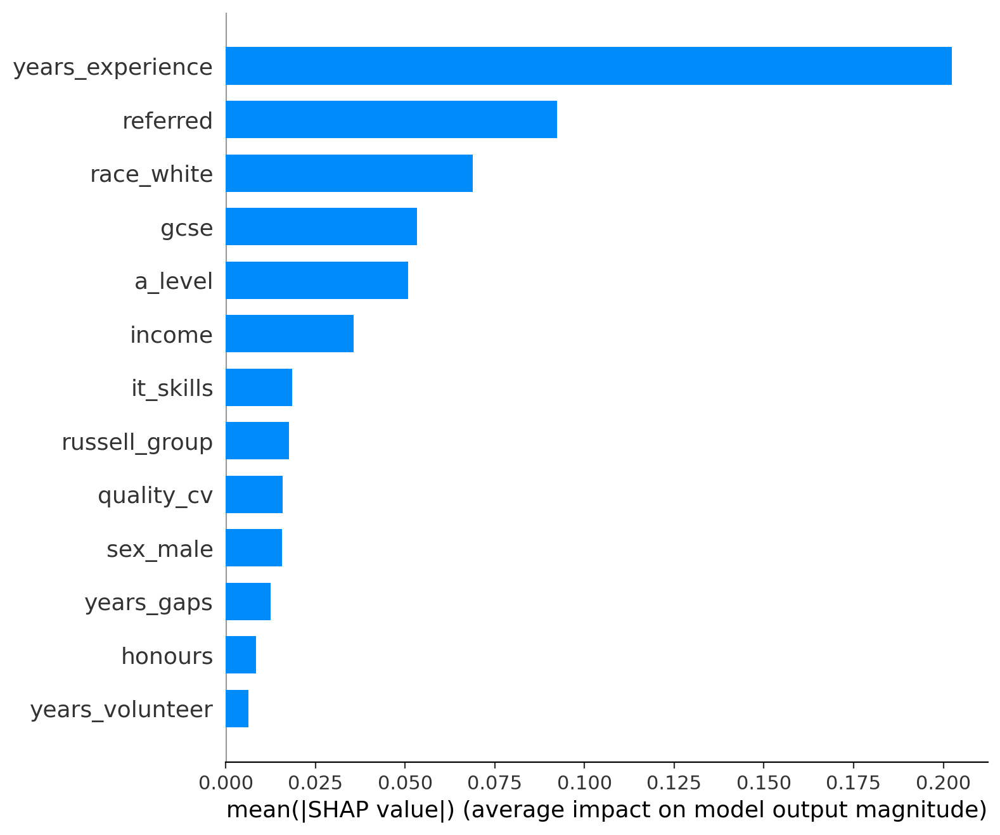
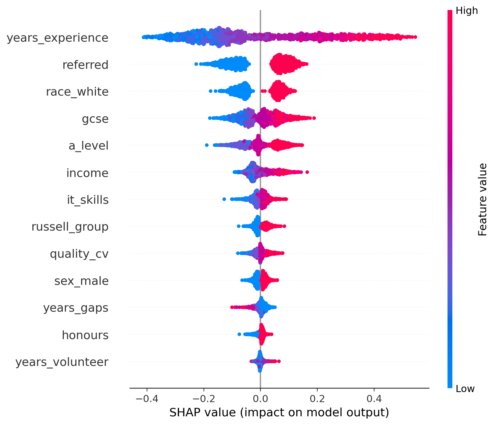

# Ethical AI Hiring System — Bias Mitigation in Recruitment

A fairness-aware machine learning pipeline for automated hiring decisions, designed to detect, measure, and mitigate bias across protected attributes (race and gender). Built as part of an ethical AI system design course project.

## Overview

AI-driven hiring tools are used by the vast majority of large companies, yet they risk perpetuating historical biases hidden in training data. This project implements a full ethical AI lifecycle — from bias detection through mitigation, explainability, and contestability — on the [CDEI UK bias-mitigation recruiting dataset](https://github.com/CDEIUK/bias-mitigation).

### Key Features

- **Multi-stage bias mitigation** — Pre-processing (Reweighing, Unawareness), In-processing (Exponentiated Gradient), and Post-processing (ThresholdOptimizer)
- **Explainability** — SHAP global/local feature importance, LIME per-prediction explanations, and DiCE counterfactual generation
- **Contestability** — Interactive appeal system where rejected applicants can challenge decisions, with human-in-the-loop reviewer dashboard
- **Model documentation** — Automated Model Card via the Patra Toolkit, including fairness metrics and explainability artifacts
- **Audit logging** — Every prediction is logged with timestamp, features, and top SHAP contributors

## Fairness Evaluation

| Method | Accuracy | DP Diff (Race) | DP Ratio (Race) | DP Diff (Gender) | DP Ratio (Gender) |
|---|---|---|---|---|---|
| Baseline RF | 84.65% | 0.333 | 0.355 | 0.162 | 0.625 |
| Reweighing (Race) | 84.25% | 0.313 | 0.382 | 0.152 | 0.644 |
| Reweighing (Gender) | 83.65% | 0.339 | 0.346 | 0.140 | 0.666 |
| Unawareness | 83.10% | 0.258 | 0.472 | 0.125 | 0.704 |
| Exponentiated Gradient (Race) | 77.40% | 0.022 | 0.939 | 0.227 | 0.506 |
| Exponentiated Gradient (Gender) | 83.70% | 0.368 | 0.335 | 0.007 | 0.981 |
| Post-processing (Race) | 78.90% | −0.004 | 1.012 | 0.165 | 0.614 |
| Post-processing (Gender) | 83.05% | 0.353 | 0.355 | −0.004 | 1.010 |

> **Key finding:** No single method achieves intersectional fairness across both race and gender simultaneously. Each technique improves fairness for the targeted group but may introduce trade-offs for others.

## Explainability

### SHAP Feature Importance

The top predictors of hiring decisions are years of experience, referral status, and race — highlighting both legitimate and potentially problematic factors driving the model.



### SHAP Summary Plot

The beeswarm plot reveals directional effects: high years of experience and being referred strongly push predictions toward "hired," while being non-white pushes predictions toward "not hired," exposing residual bias.



## Contestability System

The appeal pipeline provides:
1. **Applicant view** — Prediction probability, SHAP-based feature importance bar chart, and DiCE counterfactual suggestions
2. **Appeal submission** — Structured form for applicants to challenge decisions with written justification
3. **Reviewer dashboard** — Human reviewer sees model output, SHAP values, counterfactuals, and applicant's appeal before making a final decision
4. **Audit trail** — All appeals, reviewer comments, and outcomes are logged in `appeals.json`

## Tech Stack

- **ML & Fairness:** scikit-learn, AIF360, Fairlearn
- **Explainability:** SHAP, LIME, DiCE
- **Documentation:** Patra Toolkit (Model Cards)
- **Interface:** Jupyter + ipywidgets, HTML
- **Language:** Python 3

## Dataset

The [CDEI UK Bias Mitigation dataset](https://github.com/CDEIUK/bias-mitigation) contains 6,000 synthetic recruiting records with 14 features including education (GCSE, A-level, honours), years of experience, CV quality, IT skills, income, referral status, and protected attributes (race, gender). The dataset was pre-processed by the Centre for Data Ethics and Innovation.

## Getting Started

```bash
# Install dependencies
pip install pandas joblib numpy scikit-learn fairlearn matplotlib seaborn aif360 lime shap dice-ml ipywidgets patra_toolkit

# Run the notebook
jupyter notebook main.ipynb
```

## Project Structure

```
├── main.ipynb                  # Full pipeline: training, fairness, explainability, contestability
├── model_card.json             # Auto-generated model card with metrics and artifacts
├── appeals.json                # Appeal log (applicant challenges + reviewer decisions)
├── shap_summary.png            # SHAP beeswarm summary plot
├── shap_feature_importance.png # SHAP mean absolute feature importance
├── shap_local_top5.html        # Interactive local SHAP explanations
└── report.pdf            # Full academic report
```

## Authors
- Irmak Erkol
- Faraz Badali Naghadeh
- Pelin Karadal
- Bilgehan Çağıltay

## License

BSD-3-Clause

## References

- Kamiran & Calders (2012) — Reweighing for bias mitigation
- Agarwal et al. (2018) — Exponentiated Gradient
- Hardt, Price & Srebro (2016) — Equality of Opportunity / ThresholdOptimizer
- Ribeiro et al. (2016) — LIME
- Lundberg & Lee (2017) — SHAP
- Mothilal, Sharma & Tan (2020) — DiCE counterfactual explanations
